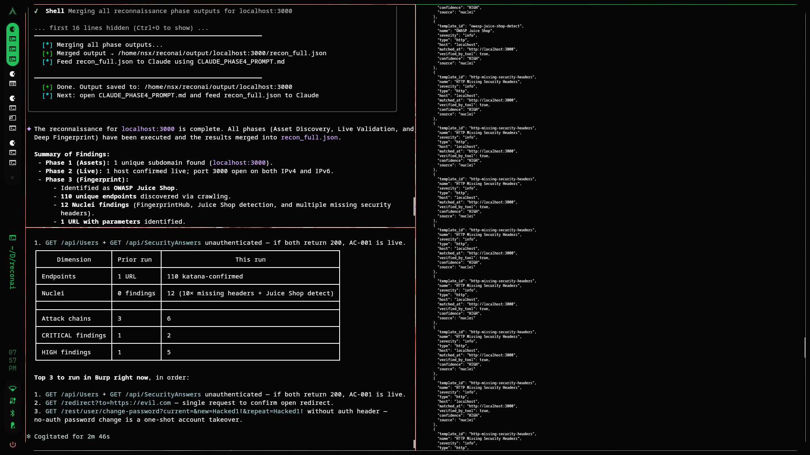

# ReconAI

AI-assisted web application recon framework for authorized penetration testing and bug bounty hunting.

Built around a division of labor: automated tools handle volume, AI handles reasoning, human handles validation.

# Example




---

## Architecture

```
Phase 1 (Passive)     → Asset Discovery
Phase 2 (Active-light) → Live Validation  
Phase 3 (Active)      → Deep Fingerprint & Crawl
                              ↓
                      recon_full.json
                              ↓
Phase 4               → Feed to Claude / DeepSeek
                              ↓
                      You validate in Burp Suite
```

---

## Install Dependencies (Arch Linux)

```bash
# Go tools
go install github.com/tomnomnom/assetfinder@latest
go install github.com/projectdiscovery/httpx/cmd/httpx@latest
go install github.com/projectdiscovery/naabu/v2/cmd/naabu@latest
go install github.com/projectdiscovery/katana/cmd/katana@latest
go install github.com/projectdiscovery/nuclei/v3/cmd/nuclei@latest
go install github.com/tomnomnom/httprobe@latest
go install github.com/tomnomnom/waybackurls@latest

# Python tools
pip install requests
pip install git+https://github.com/aboul3la/Sublist3r.git
pip install git+https://github.com/devanshbatham/paramspider.git

# AUR
yay -S whatweb
yay -S rustscan

# Nuclei templates
nuclei -update-templates
```

---

## Usage

### 1. Fill SCOPE.md first (mandatory)

```
- Domain   : juiceshop.local
- In Scope : juiceshop.local
- Auth     : CTF / personal-lab
```

### 2. Run recon

```bash
# Full pipeline (Phase 1 → 2 → 3 → merge)
python3 recon.py <target>

# Single phase
python3 recon.py <target> --phase 1
python3 recon.py <target> --phase 2
python3 recon.py <target> --phase 3

# Merge only (if phases already run)
python3 recon.py <target> --phase merge
```

### 3. Feed output to Claude (Phase 4)

Open `CLAUDE_PHASE4_PROMPT.md`, follow the template, paste `output/<target>/recon_full.json`.

---

## Output Structure

```
output/
└── <target>/
    ├── subs_all.txt          ← all discovered subdomains
    ├── live_hosts.txt        ← confirmed live hosts
    ├── phase1_assets.json    ← passive discovery results
    ├── phase2_live.json      ← live validation + ports
    ├── phase3_fingerprint.json ← crawl + nuclei findings
    └── recon_full.json       ← merged, ready for Phase 4
```

---

## Files

| File | Purpose |
|---|---|
| `recon.py` | Main orchestrator |
| `SCOPE.md` | Target scope — fill before every scan |
| `TOOL_CATALOG.md` | Tools reference for AI orchestrator |
| `GEMINI_SYSTEM_PROMPT.md` | System prompt for Gemini Flash |
| `CLAUDE_PHASE4_PROMPT.md` | Phase 4 analysis prompt for Claude |
| `phase1/runner.py` | Asset discovery runner |
| `phase2/runner.py` | Live validation runner |
| `phase3/runner.py` | Fingerprint & crawl runner |

---

## Important

- Always fill `SCOPE.md` before scanning — the framework will refuse to run without it
- This tool is for **authorized testing only** — CTF, personal lab, bug bounty in-scope targets
- Phase 4 analysis: **do not send real target data to DeepSeek** (servers outside your jurisdiction)
- All nuclei findings are **signals, not confirmed vulnerabilities** — validate manually in Burp

---

## Author

**@0xnhsec** — [github.com/0xnhsec](https://github.com/0xnhsec)
